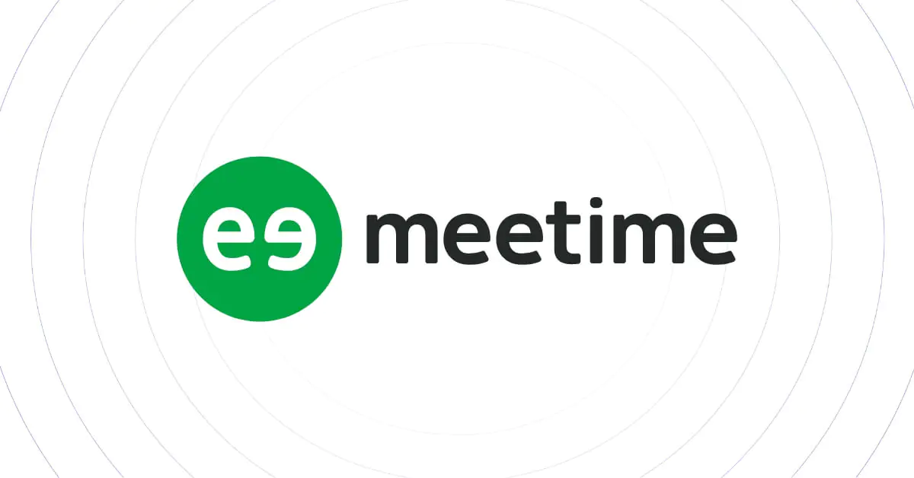
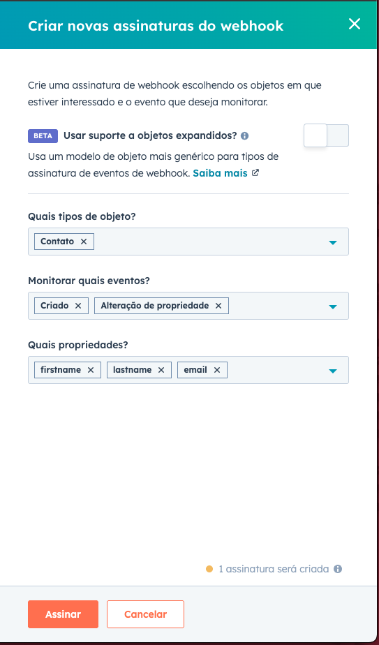

# Integração com HubSpot – Desafio Técnico Meetime

Este projeto foi desenvolvido como parte do **desafio técnico da Meetime**, com o objetivo de demonstrar habilidades em integração de APIs externas, boas práticas de desenvolvimento backend e conhecimento sobre protocolos de autenticação.

O desafio propõe a criação de uma aplicação em **Java com Spring Boot** que se integre à API do **HubSpot**, permitindo que um usuário realize a autenticação via **OAuth 2.0**, e, a partir disso, possa:

- Criar contatos em sua conta do HubSpot;
- Listar os contatos já existentes;
- Receber notificações via **Webhooks** quando contatos forem criados.

---

## 🛠️ Tecnologias utilizadas

A aplicação foi desenvolvida utilizando as seguintes tecnologias e bibliotecas:

### Backend
- **Java 21** – Linguagem principal utilizada no projeto
- **Spring Boot** – Framework para desenvolvimento da API REST
- **Spring Web** – Módulo para construção de endpoints RESTful
- **Spring Security** – Utilizado de forma mínima para tratar redirecionamentos
- **Lombok** – Reduz a verbosidade do código com anotações
- **RestTemplate** – Cliente HTTP para comunicação com a API da HubSpot
- **OpenAPI (SpringDoc)** – Geração automática da documentação Swagger
- **Jakarta Servlet API** – Usada para recebimento e leitura de payloads do Webhook
- **Maven** – Gerenciador de dependências e build do projeto

### Segurança e autenticação
- **OAuth 2.0** – Protocolo utilizado para autenticação via HubSpot
- **Bearer Token** – Utilizado para autenticar requisições à API da HubSpot
- **application-example.properties** – Arquivo de exemplo para configuração segura

### Testes manuais e validação
- **Postman** – Utilizado extensivamente para testes manuais de todos os endpoints
- **Swagger UI** – Interface interativa para testar e visualizar os endpoints da API

### Outros
- **Ngrok** – Túnel HTTP para expor a aplicação local publicamente e permitir testes com Webhooks da HubSpot
- **Git** – Versionamento de código e controle de histórico
- **GitHub** – Repositório remoto público para entrega do desafio

---

## ✅ Funcionalidades implementadas

A aplicação atende todos os requisitos propostos no desafio, incluindo:

- **Autenticação OAuth 2.0 com o HubSpot**
- **Criação de contatos no HubSpot**
- **Listagem de contatos cadastrados**
- **Recebimento de Webhooks**
- **Tratamento de erros**
- **Documentação Swagger**
- **Testes manuais documentados**

---

## 💻 Como rodar o projeto localmente

### Pré-requisitos

- Java 21
- Git
- IntelliJ IDEA
- Ngrok
- Postman

### 1. Criar uma conta e aplicativo no HubSpot

1. Crie conta em: https://developers.hubspot.com
2. Crie um App com Redirect URL: `http://localhost:8080/oauth/callback`
3. Escopos: `crm.objects.contacts.read`, `crm.objects.contacts.write`, `crm.schemas.contacts.write`, `oauth`
4. Copie o Client ID e Client Secret
5. Crie uma conta de testes em: https://app.hubspot.com/developer-test-accounts/

### 2. Clonar o repositório

```bash
git clone https://github.com/digonexs/hubspot-integration
```
```bash
cd hubspot-integration
```
### 3. Configurar o application.properties

1. Navegue até o seguinte caminho de pastas: `src/main/resources/application-example.properties`
2. Renomeie o arquivo `application-example.properties` para `application.properties`
3. Substitua `SEU_CLIENT_ID` e `SEU_CLIENT_SECRET` pelos valores de client.id e client.secret obtidos no seu app do HubSpot.

```properties
hubspot.oauth.client.id=SEU_CLIENT_ID
hubspot.oauth.client.secret=SEU_CLIENT_SECRET
hubspot.oauth.redirect.uri=http://localhost:8080/oauth/callback
hubspot.oauth.scope=crm.objects.contacts.read crm.objects.contacts.write crm.schemas.contacts.write
```

### 4. Executar o projeto

- Dentro da pasta raiz do projeto `hubspot-integration`, execute os seguintes comandos no terminal:

```bash
./mvnw clean install
```

```bash
./mvnw spring-boot:run
```

### 5. Acessar Swagger

- Com a aplicação em execução, acesse a seguinte URL em seu navegador:

```
http://localhost:8080/swagger-ui.html
```

### 6. Ngrok para Webhooks

1. Baixe e instale: https://ngrok.com
2. Em um terminal, autentique-se com o token da sua conta Ngrok (obtido em: https://dashboard.ngrok.com/get-started/your-authtoken):

```bash
ngrok config add-authtoken SEU_TOKEN_NGROK
```

3. Após a autenticação, execute o seguinte comando:

```bash
ngrok http 8080
```

4. Copie a URL fornecida pelo Ngrok na linha `Forwarding` (exemplo: `exemplo.ngrok-free.app`)
5. Acesse o app que você criou no HubSpot
6. No menu lateral esquerdo (dentro do App), vá até `Recursos` > `Webhooks`
7. Em `URL de destino`, cole a URL fornecida pelo Ngrok, adicionando `/webhook/contact` ao final. Exemplo: `https://exemplo.ngrok-free.app/webhook/contact`. Em seguida, salve.
8. Após salvar, clique em `Criar assinatura`.
9. Preencha os campos conforme o exemplo da imagem abaixo:



---

## ✅ Testes manuais e critérios de aceite

### Autenticar no HubSpot

1. Com a aplicação em execução, acesse http://localhost:8080/oauth/authorize-url no navegador.
2. Copie a URL gerada, cole-a em uma nova guia, selecione sua conta de testes e autorize o app.
3. O `access_token será exibido no terminal do IntelliJ.

---

### Coleção Postman

(`/arquivos/json_collections/Meetime HubSpot Integration.postman_collection.json`)

- Para facilitar os testes da API, incluí uma **coleção do Postman pronta** com todos os endpoints e exemplos de requisições.

#### Como importar para o Postman:
1. Abra o Postman
2. Vá para **File > Import**
3. Clique em **Upload Files**
4. Selecione o arquivo `.json` localizado no caminho acima
5. Clique em **Import**

#### O que está incluso na coleção:
- Criação de contatos com diferentes cenários (válido, inválido, sem token, campos nulos)
- Listagem de contatos (com/sem token)
- Simulação de Webhooks de criação e alteração de contato

### Como usar o token

- Para realizar os testes de criação (POST Criar contato) e listagem (GET Listar Contato), será necessário configurar os headers no Postman conforme o exemplo abaixo:

- Key: `Authorization` Value: `Bearer SEU_ACCESS_TOKEN_GERADO_NO_TERMINAL`

### Testes

| # | Cenário                    | Método | Endpoint |
|---|----------------------------|-------|----------|
| 1 | Criar contato válido       | POST  | `localhost:8080/oauth/contacts` |
| 2 | Criar contato com e-mail inválido | POST  | `localhost:8080/oauth/contacts` |
| 3 | Criar contato com campos nulos | POST  | `localhost:8080/oauth/contacts` |
| 4 | Criar contato com token incorreto | POST  | `localhost:8080/oauth/contacts` |
| 5 | Listar contatos            | GET   | `localhost:8080/oauth/contacts` |
| 6 | Listar contatos com token incorreto | GET   | `localhost:8080/oauth/contacts` |
| 7 | Webhook: criação de contato | POST  | `localhost:8080/webhook/contact` |

---

Pronto! A aplicação está pronta para testes reais com OAuth, API do HubSpot e Webhooks.

---

## 💻 Documentação Técnica

#### Decisões Técnicas:

Durante o desenvolvimento deste projeto, tomei as seguintes decisões:

- **Clareza e simplicidade**: O objetivo foi manter o código legível e de fácil manutenção.
- **Separação de responsabilidades**: Apliquei arquitetura em camadas (`Controller`, `Service`, `DTO`) para manter a organização e facilitar futuras evoluções.

#### Tecnologias e Bibliotecas Utilizadas:

| Tecnologia | Motivo                                                                          |
|------------|---------------------------------------------------------------------------------|
| **Spring Boot** | Framework principal para construção da API REST                                 |
| **Spring Web** | Permite a criação de endpoints HTTP RESTful                                     |
| **Spring Validation** | Usado para validar os dados dos DTOs (como email e campos obrigatórios)         |
| **Springdoc OpenAPI** | Geração automática da documentação Swagger da API                               |
| **Lombok** | Redução de boilerplate com geração automática de getters/setters e construtores |
| **Ngrok** | Criação de túnel público para testes de Webhook local                           |
| **Postman** | Plataforma de testes da API com diversos cenários mapeados                      |


#### Possíveis Melhorias Futuras:

- **Centralizar tratamento de exceções** compatível com Swagger.
- **Persistência em banco local** para guardar tokens e log de contatos criados.
- **Renovação automática de token**.
- **Testes automatizados** de integração e cobertura de endpoints.

---
Desenvolvido por: [Rodrigo](https://www.linkedin.com/in/rodrigocavalcantedebarros/).
---


